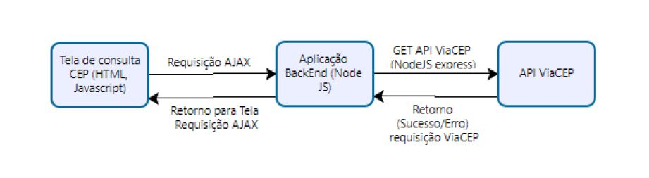

### API Node

<details>
<summary>Teste Vtrina - Desenvolvedor FullStack</summary>
<div class="text-justify">

Desenvolva uma aplicação em NodeJS para buscar o endereço, conforme o CEP informado, possuindo os seguintes requisitos:

  Uma página HTML (com bootstrap) para buscar o CEP deverá ser implementada, para consulta de CEPs, onde o usuário ao informar o CEP, receberá os detalhes de LOGRADOURO, BAIRRO, LOCALIDADE, UF, IBGE, DDD.

  - A busca pode ser realizada através da ação de apertar um botão “pesquisar” ou de forma automática se a quantidade de caracteres preenchida no input for a mesma que de um CEP (8 caracteres).
  - O layout da tela fica a escolha do avaliado.
  - Enquanto o CEP estiver sendo buscado, é preferível que possua uma tela de loading.
  Caso o CEP preenchido não seja encontrado, uma mensagem de erro deverá ser exibida.
  - A aplicação deverá utilizar a API aberta da ViaCEP (https://viacep.com.br/) para consulta dos CEPs.
  - O usuário, ao informar o CEP no campo dedicado, uma requisição Jquery Ajax, deverá ser realizada para uma API Rest da aplicação.
  - A consulta do CEP através da API ViaCEP deverá ser realizada na camada backend do NodeJS.
  Essa API deverá realizar a consulta do CEP na API da ViaCEP.
  Não será permitido realizar a consulta diretamente na API da ViaCEP, você deve realizar a requisição para a aplicação e a aplicação realizará a consulta na ViaCEP.
  A API deverá tratar exceção, caso o CEP não existir.
  Salve este projeto em algum repositório git público(github) e nos disponibilize a url para download do projeto.
</div>
</details>

### Projeto


#### Diagrama


### Instalação

Use o gerenciador de pacotes node [npm](https://docs.npmjs.com/cli/v8/commands/npm-init) para iniciar a aplicação e criar as configurações iniciais.

```bash
npm init -y
```
Ainda com npm instale o [express](https://www.npmjs.com/package/expresst) para contrução da API, [nodemon](https://www.npmjs.com/package/nodemon) para atualização simultanea do servidor backend, [axios](https://www.npmjs.com/package/axios) para requisições HTTP baseado-em-promessas para o node.js e para o navegador [cors](https://www.npmjs.com/package/cors) para permitir que a fetch do Frontend comunique com a porta do servidor declarado no Backend
```bash
npm i express axios cors nodemon
```
Conventional Commits é uma convenção em cima dos commits que fornece um conjunto fácil de regras para criar um histórico de confirmação explícito; o que torna mais fácil escrevê-los e identifica-los. 
```bash
npm i -D git-commit-msg-linter
```
### Algumas configurações API


### Como usar
Suba o servidor backend com comando:
```bash
npm start
```
Execute o index.html para exibir o frontend - Abra-o com Lite Server ou Preview de HTML de sua preferencia

### Ferramentas Utilizadas
- Visual Studio Code
- WSL Ubuntu 20.04LTS
- Node v16.15.1
- npm 8.11.0

### Autor
Jordan Cruz
